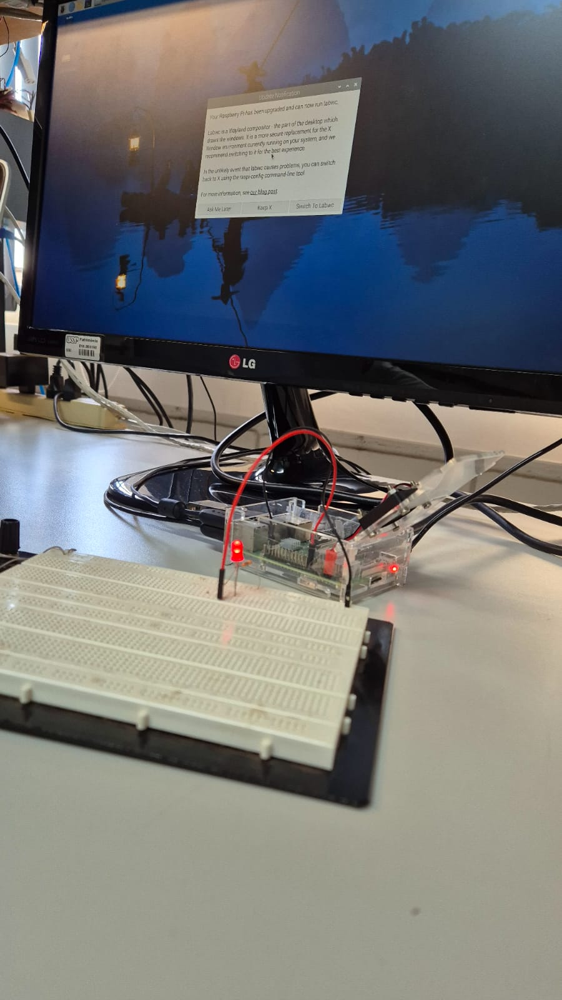

# SEL0337 - Relatório da Prática 5: Configuração do SystemD para Personalização de Serviços de Inicialização de S.O. em Linux Embarcado, Controle de Versão e Repositório de Códigos com Git e GitHub

Alunos responsáveis:
- Alexandre Luigi Caruso (12547580)
- Brian Nicholas Alves Rondon Lahr (12547805)
- Daniel Fagundes Oliveira (12384492)

## Objetivo
O objetivo desta prática é configurar um serviço personalizado utilizando o SystemD em uma Raspberry Pi, permitindo que uma aplicação embarcada inicie automaticamente durante o processo de boot do sistema operacional Linux. Na primeira parte da prática, os arquivos executados estão de acordo com o PDF da Prática em questão. Em seguida, arquivos .py são executados tanto durante a inicialização (_boot_) quanto após a finalização (_systemctl stop_).

## Contextualização:

Alguns dos conteúdos mais importantes no contexto desta prática são:
- **SystemD**: Um sistema de inicialização moderno utilizado em distribuições Linux que gerencia serviços e processos.
- **Init System**: O estágio responsável pela inicialização do sistema operacional após o carregamento do kernel.
- **Service Unit**: Um arquivo de configuração que define como um serviço deve ser iniciado, parado e gerenciado pelo SystemD.

## Etapas Realizadas

1. **Preparação do Ambiente**
   - Atualização do sistema com o comando:
     ```bash
     sudo rpi-update
     ```

2. **Montagem do Circuito**
   - Conexão física de um LED ao GPIO 23 da Raspberry Pi, conforme a imagem abaixo:

  


3. **Criação do Script Bash**
   - Desenvolvimento de um script `blink_s.sh` para controlar o LED:
     ```bash
     #!/bin/bash

     PIN=23
     
     echo $PIN > /sys/class/gpio/export
     echo out > /sys/class/gpio/gpio$PIN/direction
     while [ 1 ]
     do
         echo 1 > /sys/class/gpio/gpio$PIN/value
         sleep 0.2
         echo 0 > /sys/class/gpio/gpio$PIN/value
         sleep 0.2
     done
     ```
   - O script configura o pino GPIO 23 como saída e alterna seu estado para piscar o LED.

4. **Configuração de Permissões**
   - Atribuição de permissões de execução ao script:
     ```bash
     chmod +x blink_s.sh
     ```

5. **Criação da Unidade de Serviço**
   - Criação de um arquivo chamado `blink.service` com o seguinte conteúdo:
     ```
     [Unit]
     Description= Blink LED
     After=multi-user.target

     [Service]
     ExecStart=/home/sel/blink.sh

     [Install]
     WantedBy=multi-user.target
     ```
   - Este arquivo define as configurações necessárias para que o script seja executado durante a inicialização. Em seguida, um arquivo `blink_py.service` é   utilizado, com configurações tanto para a incialização (`ExecStart`) quanto a finalização (`ExecStop`).

## Resultados Esperados
Após a configuração, espera-se que o LED comece a piscar automaticamente quando a Raspberry Pi for ligada, demonstrando que o serviço foi corretamente integrado ao processo de boot através do SystemD. Isso é demonstrado nos vídeos a seguir:

Inicialização: [Assista ao vídeo 1 no YouTube](https://youtube.com/shorts/DLFVLyqlLfI?feature=share)
Finalização: [Assista ao vídeo 2 no YouTube](https://youtube.com/shorts/2wr0OmNhB7o?feature=share)
